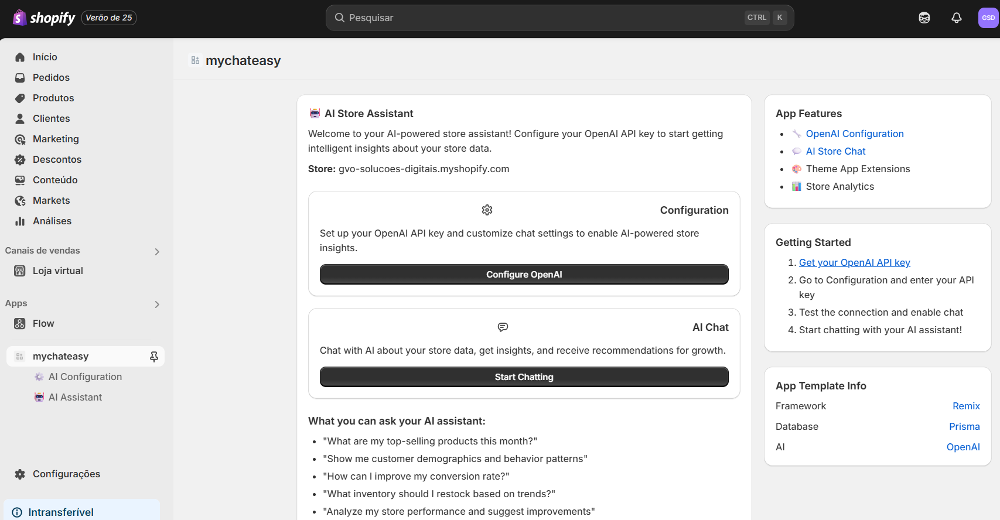
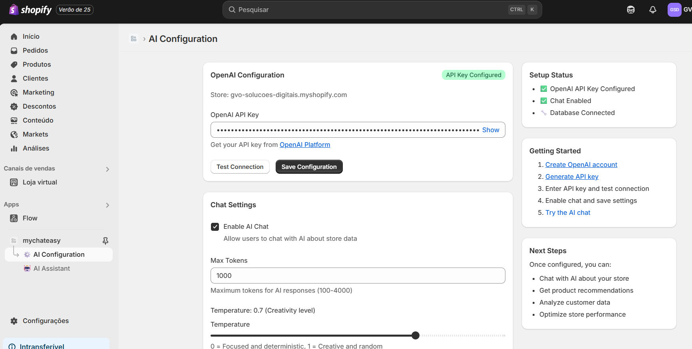
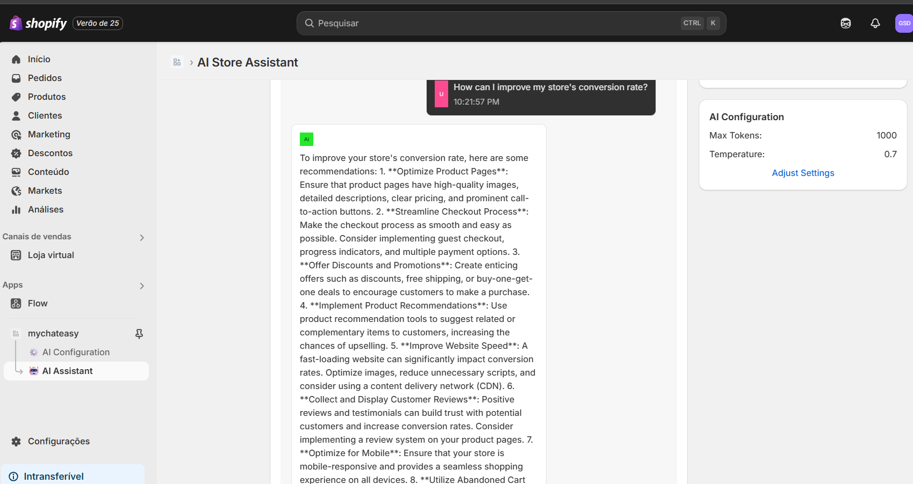
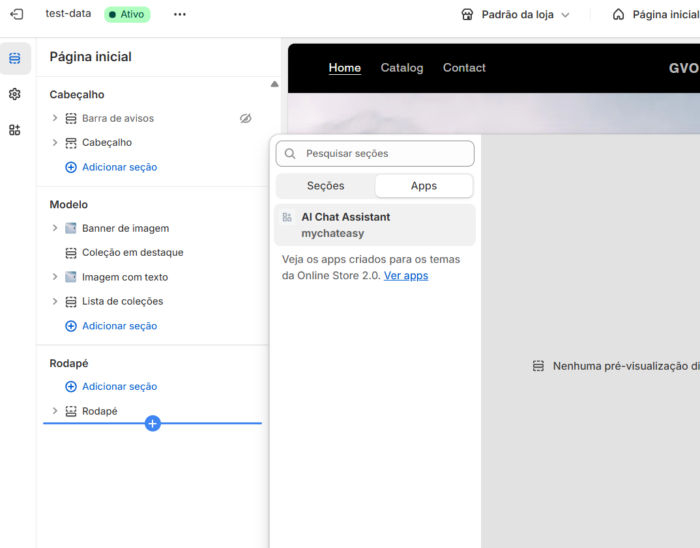
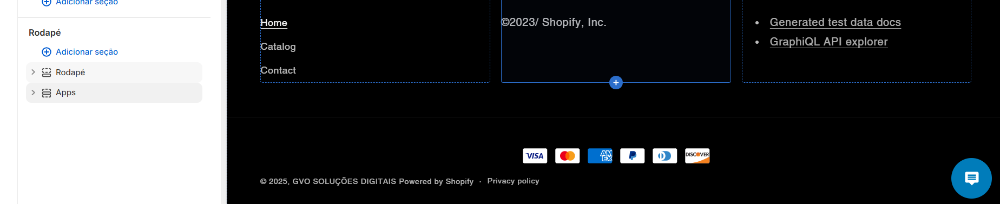
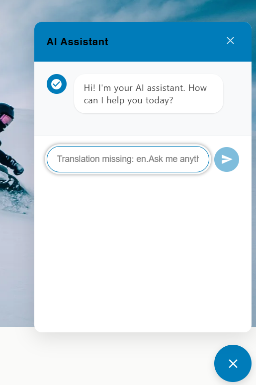

# Simple-Shopify-App-Theme-Extension
Code with example on how to structure a shopify app having theme additions throught Theme App Extensions.

## Admin
The admin area enable the user to interact with some data of the shop using OpenAI API, configuring the API with own key. Saved in SQLite. Admin area using Polaris design system.

## Theme App Extension
Also is configured an app extension to show a chat area in the frontend, simulating the integration with the backend (will be necessary to structure a middleware backend to connect Admin dashboard configuration and frontend, but the code in Shopify-related points will not need many changes).

## Images
### Administration Area

#### Home Page

#### Configuration Page

#### Chat in Admin page

### Theme App Extension
#### Theme App Selection in Theme Editor

#### Widget Visualization in Theme Editor

#### Chat Widget in Store

### Pending points
The code has some points that could be improved
- Backend code to connect Administrator system and Widget in Theme App Extension
- PostgreSQL Database Integration
- Chat improvement (In widget and in administrator dashboard)
